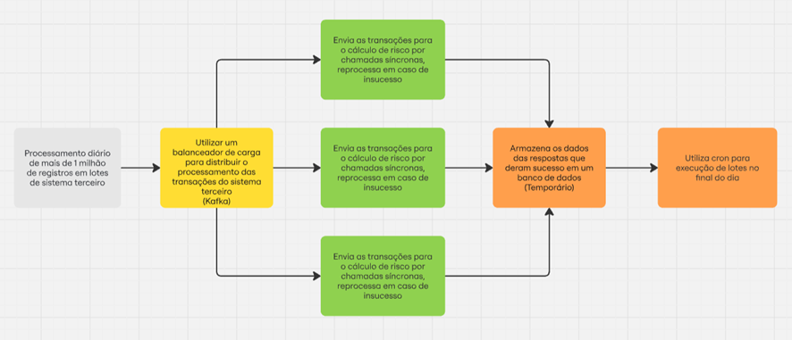

Avaliação Analista de Sistemas

Parte 1 – Estudo de Caso
Você é o analista de sistemas encarregado de um sistema transacional crítico na Cooperativa, destinado ao processamento diário de mais de 1 milhão de registros em lotes. Ao longo do dia, o sistema recebe transações de outros sistemas e executa cálculos de risco usando um sistema terceiro integrado à nossa infraestrutura. Os resultados desses cálculos são armazenados temporariamente para posterior envio no processo de lote diário. Qualquer período de inatividade, mesmo que breve, pode ter consequências jurídicas significativas para a Cooperativa. Com isso em mente, o teste consiste em:

1. Desenho da Solução: Como você projetaria a arquitetura desse sistema? Ele deve suportar chamadas assíncronas de outros sistemas e enviar chamadas síncronas para o sistema terceiro. Além disso, há a execução de lotes ao final do dia. Você pode utilizar ferramentas de desenho de soluções ou fluxogramas para detalhar sua proposta.

2. Garantia de Qualidade e Disponibilidade: Considerando o impacto jurídico de qualquer falha, como você garantiria a qualidade e a disponibilidade deste sistema? Que medidas seriam adotadas para assegurar a disponibilidade do sistema terceiro que recebe as informações?
     **R. Para garantir a qualidade e disponibilidade do sistema seria necessário utilizar ferramentas de monitoramento (Ex. Grafana), utilizar kubernetes para grandes cargas de trabalho, testes automatizados com Xunit, utilizar plataformas de nuvem pública com servidor em diferentes regiões.Com relação ao sistema terceiro é necessário formalizar um acordo, realizar o monitoramento da disponibilidade do sistema terceiro e caso o sistema fique indisponível realizar o backup das informações para que sejam processadas assim que o sistema voltar a funcionar.**

3. Delegação de Desenvolvimento: Caso precise delegar partes do desenvolvimento a outros membros da equipe, como você organizaria essa delegação para garantir a eficiência e a qualidade do projeto?
     **R. Primeiro seria necessário dividir o projeto em pacotes com escopo bem definidos para que o desenvolvimento pudesse acontecer em paralelo. Utilizar uma ferramenta de kanban para gerenciar as atividades. Definir qual a estrutura de código deverá ser seguida de acordo com padrões de código e clean code. Realizar code review para garantir a qualidade do código. Utilizar ferramentas para documentação do código, para facilitar a compreensão e a futura manutenção ou continuidade do trabalho.**

4. Atualização do Sistema Terceiro: Foi identificado que uma nova funcionalidade exigirá uma atualização no sistema terceiro, porém atualizações anteriores enfrentaram problemas. Como você asseguraria junto ao parceiro uma atualização bem-sucedida e livre de problemas?
     **R. Planejar execução de testes de regressão em ambiente de homologação. Caso não seja possível realizar em ambiente de homologação acertar com o fornecedor um plano de contingência com backup e possível rollback. Agendar uma janela de atualização para que os usuários possam ser avisados da possível indisponibilidade.**

5. Diagramação no C4 Model (Opcional): Opcionalmente, tente diagramar a arquitetura do sistema utilizando o padrão C4 Model. Não é necessário cobrir todos os níveis, mas focar no nível que considera mais eficaz para documentar o sistema para os colaboradores da equipe. https://c4model.com/

Parte 2 – Case de Sucesso
Apresente um case de sucesso em sua carreira, destacando um sistema que considera exemplar independentemente da tecnologia ou do setor de negócios:
 **Integração de sistema de controle de acesso.**

1. Por que você considera esse sistema um case de sucesso?
    **R. Porque vem sendo utilizado pela empresa há algum tempo.**

2. Quantas pessoas colaboraram neste projeto e qual foi sua principal responsabilidade?
    **R. 4 pessoas. Gerente, Scrum, Terceiro e eu. Meu papel foi realizar a integração com o sistema terceiro.**
3. Se você começasse a trabalhar neste sistema hoje, o que faria de maneira diferente?
     **R. A forma de comunicação entre os sistemas, que hoje é feito por Firebase, utilizaria uma ferramenta como Kafka.**

4. O que você identificou como aspectos altamente eficazes neste sistema que gostaria de replicar em outras soluções?
     **R. O processamento multithread dos processos para atualização dos equipamentos.**

5. Como você assegurou ou asseguraria a continuidade deste sistema após deixar a empresa?
    **R. Foram feitos manuais técnicos e manuais de utilização para o usuário.**
